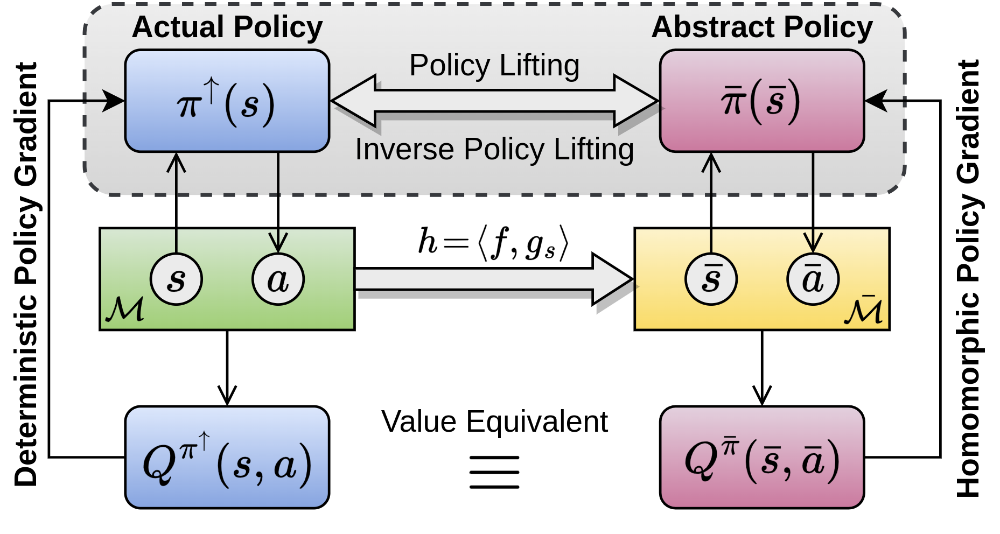

# Continuous MDP Homomorphisms and Homomorphic Policy Gradients

### Update (May, 12, 2023) 
* _Stochastic DHPG_ algorithm has been added to this repository. The original [NeurIPS 2022](https://arxiv.org/abs/2209.07364) 
paper proposes _deterministic DHPG_, while the following preprint introduces _stochastic DHPG_ and compares it against
the deterministic variant:

["Policy Gradient Methods in the Presence of Symmetries and State Abstractions", Prakash Panangaden, Sahand Rezaei-Shoshtari, Rosie Zhao, David Meger, Doina Precup. Preprint. 2023](https://arxiv.org/abs/2305.05666)

* In order to run the new agents with the stochastic policy, follow the instructions below and simply use `agent=stochastichpg` for stochastic DHPG,
or `agent=stochastichpg_aug` for stochastic DHPG with image augmentation.

* The novel symmetric environments (Section 7.2) are in the repos [symmetry_RL](https://github.com/sahandrez/symmetry_RL) 
and [mountain_car_3D]()

---
### Instructions for the NeurIPS 2022 Paper
* Author's PyTorch implementation of Deep Homomorphic Policy Gradients (DHPG). If you use our code, please cite our NeurIPS 2022 paper:

["Continuous MDP Homomorphisms and Homomorphic Policy Gradient". Sahand Rezaei-Shoshtari, Rosie Zhao, Prakash Panangaden, David Meger, and Doina Precup. In Advances in Neural Information Processing Systems (NeurIPS). 2022.
](https://arxiv.org/abs/2209.07364)

* DHPG simultaneously learns the MDP homomorphism map and learns the optimal policy using the 
homomorphic policy gradient theorem for continuous control problems:
<p align="center">
  
</p>


## I. Setup
* Install the following libraries needed for Mujoco and DeepMind Control Suite:
```commandline
sudo apt update
sudo apt install libosmesa6-dev libgl1-mesa-glx libglfw3
```
* Install [Mujoco](https://github.com/deepmind/mujoco) and [DeepMind Control Suite](https://github.com/deepmind/dm_control)
following the official instructions.
* We recommend using a conda virtual environment to run the code.
Create the virtual environment:
```commandline
conda create -n hpg_env python=3.8
conda activate hpg_env
pip install --upgrade pip
```
* Install dependencies of this package:
```commandline
pip install -r requirements.txt
````

## II. Instructions
* This code includes our Python implementation of DHPG and all 
the baseline algorithms used in the paper: 
  * **Pixel observations:** Deterministic DHPG, Stochastic DHPG, DBC, DeepMDP, SAC-AE, DrQ-v2.
  * **State observations:** Deterministic DHPG, Stochastic DHPG, TD3, DDPG, SAC.
* Results were obtained on Python v3.8.10, CUDA v11.4, PyTorch v1.10.0 on 10 seeds.

### Training on Pixel Observations (Section 7.2, Appendices D.2, D.5, D.6 of the NeurIPS Paper)
* To train agents on pixel observations:
```commandline
python train.py task=pendulum_swingup agent=hpg 
```
* Available **DHPG** agents are: `hpg`, `hpg_aug`, `stochastichpg`, `stochastichpg_aug`, `hpg_ind`, `hpg_ind_aug`:
  * `hpg` is the deterministic DHPG variant in which gradients of HPG and DPG are summed 
  together for a single actor update (`hpg_aug` is `hpg` with image augmentation.) 
  * `stochastic_hpg` is stochastic DHPG (`stochastic_hpg_aug` is `stochastic_hpg` with image augmentation) 
  * `hpg_ind` is the deterministic DHPG variant in which gradients of HPG and DPG are 
   used to independently update the actor (`hpg_ind_aug` is `hpg_ind` with image augmentation.)
  * See Appendix D.5 for more information on these variants. 
* Available **baseline** agents are: `drqv2`, `dbc`, `deepmdp`, `sacae`.
  * You can run each baseline with image augmentation by simply adding `_aug` to the end
  of its name. For example, `dbc_aug` runs `dbc` with image augmentation. 
* If you do not have a CUDA device, use `device=cpu`.

### Training on State Observations (Section 7.1, Appendix D.1 of the NeurIPS Paper)
* To train agents on state observations:
```commandline
python train.py pixel_obs=false action_repeat=1 frame_stack=1 task=pendulum_swingup agent=hpg 
```
* Available **DHPG** agents are: `hpg`, `hpg_ind`, `stochastichpg`.
* Available **baseline** agents are: `td3`, `sac`, `ddpg_original`, `ddpg_ours`.

### Transfer Experiments (Appendix D.3 of the NeurIPS Paper)
* To run the transfer experiments, use `python transfer.py` with the same configurations discussed above for
pixel observations, but use `cartpole_transfer`, `quadruped_transfer`, `walker_transfer`, or `hopper_transfer` 
as the `task` argument.

### Tensorboard
* To monitor results use:
```commandline
tensorboard --logdir exp
```

## III. Citation
If you are using our code, please cite our NeurIPS 2022 paper: 
```bib
@article{rezaei2022continuous,
  title={Continuous MDP Homomorphisms and Homomorphic Policy Gradient},
  author={Rezaei-Shoshtari, Sahand and Zhao, Rosie and Panangaden, Prakash and Meger, David and Precup, Doina},
  journal={arXiv preprint arXiv:2209.07364},
  year={2022}
}
```
And our extended preprint which contains the theoretical and empirical results for stochastic policies:
```bib
@article{panangaden2023policy,
  title={Policy Gradient Methods in the Presence of Symmetries and State Abstractions},
  author={Panangaden, Prakash and Rezaei-Shoshtari, Sahand and Zhao, Rosie and Meger, David and Precup, Doina},
  journal={arXiv preprint arXiv:2305.05666},
  year={2023}
}
```
